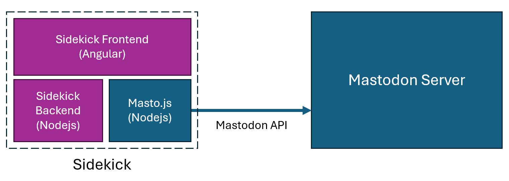

# Sidekick

A Mastodon web client, in which the User can post through a variety of Bots.


## Architecture

Sidekick makes use of `masto.js` to post to the API of a specified mastodon server.



## Start

Both the frontend and the backend need to be running.
Node and npm need to be installed on the system.
Also, you need a mastodon account and API Token (you can get this easily via the settings in the Mastodon client).

### Frontend

First install the npm-dependencies via:

```bash
npm install
```

Then, run the following command under the ``frontend``-folder:

````bash
npm start
````

### Backend

First, you again need to install the npm-dependencies via:

````bash
npm install
````

Then, run the following command under the `backend`-folder:

````bash
node .\index.js "URL" "MY_TOKEN"
````

For example:

````bash
node .\index.js "https://mastodon.social" "MY_TOKEN"
````

### Opening the app

The frontend should be accessible on ``http://localhost:4200`` in a browser on the system, communicating with the backend over port 3000.

Congratulations! Now you should be all set and able to post to your Mastodon account with Sidekick.
